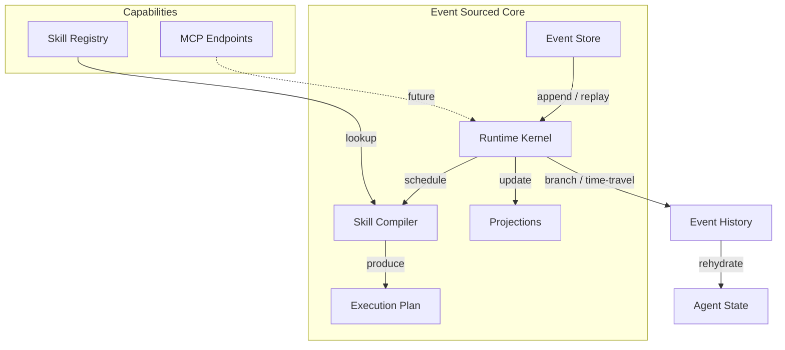

# E-COS: Event-Sourced Cognitive Operating System

[](https://www.python.org/)
[](https://opensource.org/licenses/MIT)
[](https://github.com/astral-sh/ruff)
[](https://github.com/AvaPrime/ecos/actions/workflows/ci.yml)

> **The event graph *is* the OS.**
> Agents schedule Skills. MCP provides pure capabilities. UI and external systems are pure projections of the underlying event-sourced truth.

E-COS provides the foundational primitives for building **deterministic, branching, replayable cognitive runtimes**. It treats the immutable event log as the single source of truth, enabling time-travel debugging, hypothetical simulation (branching), exact state rehydration, and auditable agentic workflows.

This is Phase 0 of the broader [Codessa](https://github.com/AvaPrime/codessa) unified intelligence system.

## Table of Contents

- [Architecture Summary](#architecture-summary)
- [Key Features](#key-features)
- [Installation](#installation)
- [Quick Start](#quick-start)
- [Core Concepts](#core-concepts)
- [Development](#development)
- [Testing](#testing)
- [Releases & Versioning](#releases--versioning)
- [Roadmap](#roadmap)
- [Contributing](#contributing)
- [License](#license)

## Architecture Summary



**Core Flow**:
1. Events are appended immutably to the Event Store.
2. RuntimeKernel records facts and triggers projections.
3. SkillCompiler turns intent → deterministic ExecutionPlan.
4. Projections rebuild read models by replaying events (no mutable state drift).
5. Branching creates alternative timelines for simulation without affecting main history.

See [ARCHITECTURE.md](docs/ARCHITECTURE.md) and [docs/adr/](docs/adr/) for deeper decisions.

## Key Features

- **Event Sourcing as OS** — Every change is an immutable, causally-linked fact.
- **Deterministic Replay** — Rebuild any past state exactly.
- **Branching & What-If** — `create_branch()` for safe simulation of alternative futures.
- **Skill-First Design** — Skills are versioned, schema-validated, first-class citizens.
- **Projection Model** — Efficient derived views; StateRehydrator for memory/agent restoration.
- **Minimal Core** — Few runtime deps (pydantic). Everything else is optional or pluggable.
- **Production Foundations** — Type-safe (mypy), linted (ruff), tested (pytest), conventional commits.

## Installation

```bash
pip install ecos
# or from source
pip install -e ".[dev]"
```

Requires Python ≥ 3.11.

## Quick Start

```python
from ecos import RuntimeKernel, Event

kernel = RuntimeKernel()

# Record facts
kernel.record_event(Event(type="BeliefUpdated", payload={"belief": "water is wet"}))

# Schedule work via natural-language-ish intent (naive compiler in v0.1)
plan = kernel.schedule_skill("echo the current system status")
print(plan)

# Time travel
history = kernel.replay()
print(f"Processed {len(history)} events")
```

See [examples/basic_usage.py](examples/basic_usage.py) for full runnable demo.

## Core Concepts

### Event
Immutable fact with ID, type, timestamp, payload, causation/correlation for full causality graph.

### Skill & Compiler
Skills are the "verbs" of the system. Compiler (future: LLM + symbolic) produces ExecutionPlans.

### RuntimeKernel
The scheduler, recorder, and projection maintainer. Supports branching.

### Projections & Rehydration
Read models rebuilt from events. Enables memory vaults, agent state snapshots, and drift-free state.

Full details in [ARCHITECTURE.md](docs/ARCHITECTURE.md).

## Development

```bash
# Setup
git clone https://github.com/AvaPrime/ecos.git
cd ecos
python -m venv .venv && source .venv/bin/activate
pip install -e ".[dev]"

# Format + Lint
ruff format src tests
ruff check src tests --fix

# Type check
mypy src

# Test
pytest -q

# Pre-commit (recommended)
pre-commit install
```

See [CONTRIBUTING.md](CONTRIBUTING.md) for full workflow.

## Testing

```bash
pytest --cov=src/ecos -ra
```

We aim for >85% coverage on core modules. Slow/integration tests marked accordingly.

## Releases & Versioning

We use [Semantic Versioning](https://semver.org/) + [Conventional Commits](https://www.conventionalcommits.org/).

- `feat:` → minor
- `fix:` → patch
- `feat!:` or BREAKING → major

Releases are automated via GitHub Actions on tag push (see [RELEASE.md](RELEASE.md)).
Changelog is maintained in [CHANGELOG.md](CHANGELOG.md).

## Roadmap

See [ROADMAP.md](ROADMAP.md) for detailed milestones.

**Current (v0.1.x — Foundations)**
- [x] Core event model + in-memory store
- [x] Skill abstraction + naive compiler
- [x] RuntimeKernel with replay & branching
- [x] Basic projections + rehydrator
- [ ] Persistent EventStore (PostgreSQL adapter)
- [ ] SkillIR / AST compiler pipeline
- [ ] WASM skill execution sandbox

**Next (v0.2 — Agentic Layer)**
- MCP integration for capability providers
- Agent scheduling loop
- Memory vault rehydration
- Projection snapshots

## Contributing

We welcome contributions that align with the architectural principles of determinism, event-sourcing purity, and separation of concerns.

Please read:
- [CONTRIBUTING.md](CONTRIBUTING.md)
- [CODE_OF_CONDUCT.md](CODE_OF_CONDUCT.md)
- [SECURITY.md](SECURITY.md)

Bug reports and feature requests use the issue templates.

## License

This project is licensed under the MIT License — see the [LICENSE](LICENSE) file for details.

Copyright (c) 2026 Ava Prime / Codessa Project.
